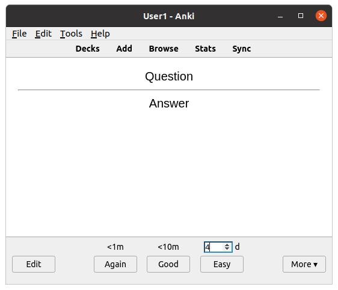
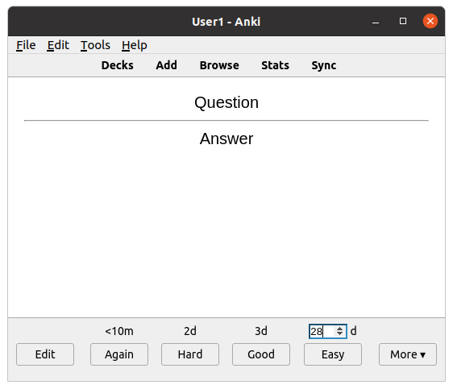

# ankiAddonEasyOverride
Add-on for the computer version of Anki to allow to specify a custom review interval, i.e. to override the next review interval for the Easy answer button

The "Easy" review interval defaults to the value that it would have had without this add-on. You can accept the default or enter any value in days.

This option comes handy e.g. when you are cramming for an exam and want to make sure that a card is presented again before the exam day, but all displayed intervals don't fit.

